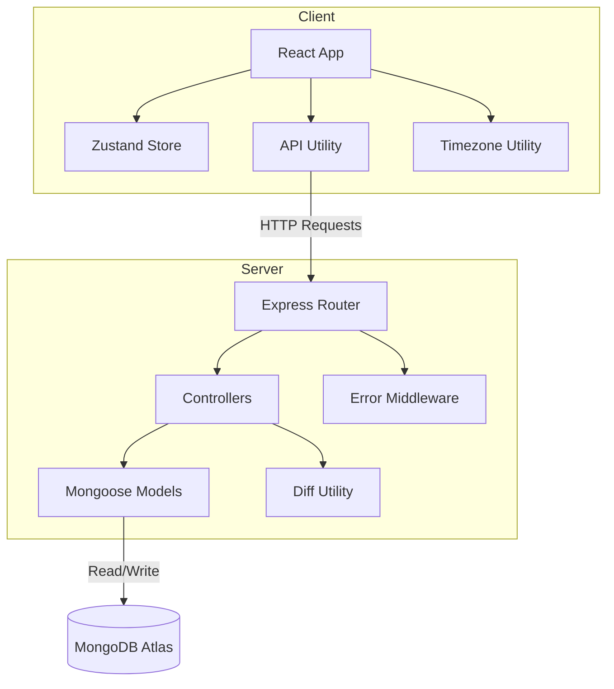
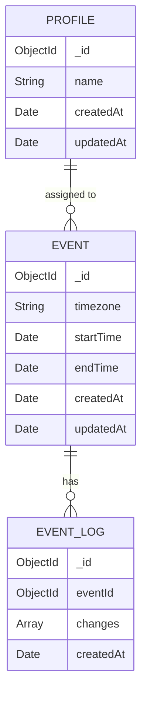
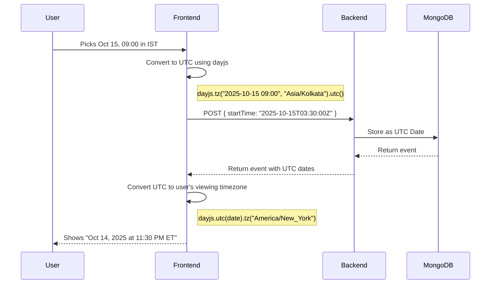
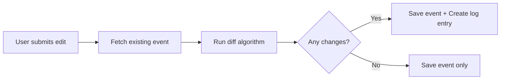

# SkailLama Take Home

An event management system where you can create profiles, schedule events across timezones, and track every change made to an event. Built with the MERN stack.

---

## What it does

You pick a profile from the top-right corner. Then you can create events, assign them to one or more profiles, pick a timezone, and set the start and end dates. All events show up on the right side, converted to whatever timezone you choose to view them in.

Every time someone updates an event, the system logs what changed. You can view the full update history of any event with timestamps that respect the timezone you are viewing in.

---

## Tech Stack

| Layer | Technology |
|-------|-----------|
| **Frontend** | React (Vite) |
| **State** | Zustand |
| **Styling** | Vanilla CSS |
| **Backend** | Express.js |
| **Database** | MongoDB (Mongoose) |
| **Timezone** | dayjs with UTC and timezone plugins |

---

## Architecture

The app follows a pretty standard client-server setup. The frontend talks to the backend through REST APIs. All dates are stored in **UTC** in the database and converted to the user's selected timezone on the frontend.



The frontend never stores anything in local storage. Every action goes through the API.

---

## Database Schema

All timestamps are stored as UTC. The `timezone` field on an event just records what timezone it was *created in*, so we can reference it later during edits.



**Why separate collections for logs?**

Logs can grow without any limit. If we embedded them inside the event document, the event would get bloated over time. Keeping them in a separate collection means events stay lean and logs are queryable on their own.

---

## API Endpoints

| Method | Endpoint | What it does |
|--------|----------|-------------|
| `GET` | `/api/profiles` | Get all profiles sorted by name |
| `POST` | `/api/profiles` | Create a new profile |
| `GET` | `/api/events?profileId=xxx` | Get events for a specific profile |
| `POST` | `/api/events` | Create a new event |
| `PUT` | `/api/events/:id` | Update an event (also logs the changes) |
| `GET` | `/api/events/:id/logs` | Get the update history for an event |

---

## How Timezone Conversion Works

This was the trickiest part of the project. Here is the flow:



The golden rule is: **store in UTC, display in local**. The database never knows about timezones. All the conversion happens on the frontend using `dayjs`.

---

## How Update Logging Works

When someone edits an event, the backend compares the old values with the new values field by field. If something changed, it creates a log entry.



The diff utility compares each field individually. For the profiles array, it sorts the IDs first and then compares, so the order doesnt matter. This is a simple but effective approach that works well for this use case.

Each log entry captures:
- **Which fields** changed
- **Old value** and **new value** for each field
- **Timestamp** of the change (stored in UTC, displayed in user's timezone)

---

## Project Structure

```
.
├── server/
│   ├── config/
│   │   └── db.js                  # MongoDB connection
│   ├── models/
│   │   ├── Profile.js
│   │   ├── Event.js
│   │   └── EventLog.js
│   ├── controllers/
│   │   ├── profileController.js
│   │   └── eventController.js
│   ├── routes/
│   │   ├── profileRoutes.js
│   │   └── eventRoutes.js
│   ├── middleware/
│   │   └── errorHandler.js        # Central error handler
│   ├── utils/
│   │   ├── ApiError.js            # Custom error class
│   │   ├── asyncHandler.js        # Wraps async routes
│   │   └── diffEvent.js           # Computes old vs new diff
│   └── server.js
│
├── client/
│   └── src/
│       ├── components/
│       │   ├── Modal.jsx          # Reusable modal wrapper
│       │   ├── MultiSelect.jsx    # Reusable multi-select dropdown
│       │   ├── TimePicker.jsx     # Reusable time input
│       │   ├── TimezoneSelect.jsx # Reusable timezone dropdown
│       │   ├── Icons.jsx          # SVG icon components
│       │   ├── Header.jsx
│       │   ├── ProfileSelector.jsx
│       │   ├── CreateEventForm.jsx
│       │   ├── EventList.jsx
│       │   ├── EventCard.jsx
│       │   ├── EditEventModal.jsx
│       │   └── EventLogsModal.jsx
│       ├── store/
│       │   └── useStore.js        # Zustand global state
│       ├── utils/
│       │   ├── api.js             # Fetch wrapper for all endpoints
│       │   └── timezone.js        # dayjs setup and helpers
│       ├── App.jsx
│       └── main.jsx
```

---

## Getting Started

**Prerequisites**: Node.js and a MongoDB Atlas account (free tier works fine).

**1. Clone the repo**

```bash
git clone https://github.com/thekaailashsharma/Skailama-Takehome.git
cd Skailama-Takehome
```

**2. Setup the backend**

```bash
cd server
npm install
```

Create a `.env` file in the `server/` folder:

```
MONGODB_URI=your_mongodb_connection_string
PORT=5001
CLIENT_URL=http://localhost:5173
```

**3. Setup the frontend**

```bash
cd client
npm install
```

Create a `.env` file in the `client/` folder:

```
VITE_API_URL=http://localhost:5001/api
```

**4. Run both**

In one terminal:
```bash
cd server && npm run dev
```

In another terminal:
```bash
cd client && npm run dev
```

Open `http://localhost:5173` and you should be good to go.

---

## Deploy on Vercel

Both frontend and backend run on Vercel (API as serverless functions). No separate backend host needed.

1. Push the repo to GitHub and import the project in [Vercel](https://vercel.com).
2. Set **Root Directory** to the repo root (leave default).
3. Add **Environment Variables** in the Vercel dashboard:
   - `MONGODB_URI` – your MongoDB Atlas connection string
   - `CLIENT_URL` – your Vercel app URL, e.g. `https://your-app.vercel.app`
   - `VITE_API_URL` – set to `/api` so the client calls the same origin
4. Deploy. The build runs the client, and `/api/*` is served by the Express app as a serverless function.

Local dev is unchanged: run `server` and `client` as above; the API runs on a normal Node server when `VERCEL` is not set.

---

## Design Decisions

**Why Zustand over Redux?**

The state in this app is pretty simple -- a list of profiles, a selected profile, a list of events, and a timezone string. Redux would have been overkill. Zustand gives us a single-file store with no boilerplate.

**Why vanilla CSS?**

The assignment mentioned bonus points for it. Plus, for a project this size, a CSS framework would add more complexity than it removes. CSS variables handle the theming and the file-per-component approach keeps things organized.

**Why dayjs?**

It is lightweight (2KB), has good timezone support through plugins, and the assignment specifically recommended it. Moment.js would work too but it is much heavier and technically deprecated.

**Why separate EventLog collection?**

Embedding logs inside events would be simpler, but logs can grow without bound. A separate collection keeps events performant and lets us query logs independently if needed.

---

## DSA Concepts Used

- **Set** for deduplicating profile IDs when creating or updating events
- **Sorting** profile ID arrays before comparison in the diff algorithm (makes order-independent comparison possible)
- **Hash map lookups** for O(1) timezone label resolution
- **Field-by-field diff** comparison algorithm for detecting event changes
- **Memoization** with `useCallback` and `useMemo` in React to avoid unnecessary re-renders

---

## A Note on AI

I used AI (mostly Cursor with Claude) as a reference and guidance tool throughout this project. It helped me think through the timezone conversion logic, plan the database schema, and debug a couple of tricky edge cases with the diff utility. The architecture decisions, component structure, and actual implementation are my own work. I believe using AI as a thinking partner adds genuine value to the development process, and I wanted to be upfront about it.

---

*Built by Kailash Sharma*
